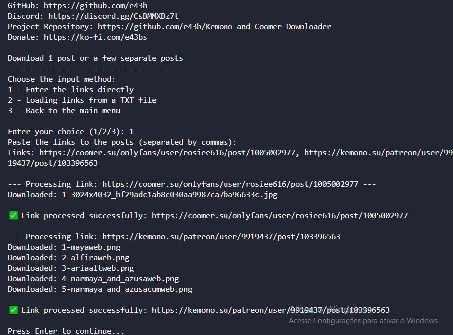
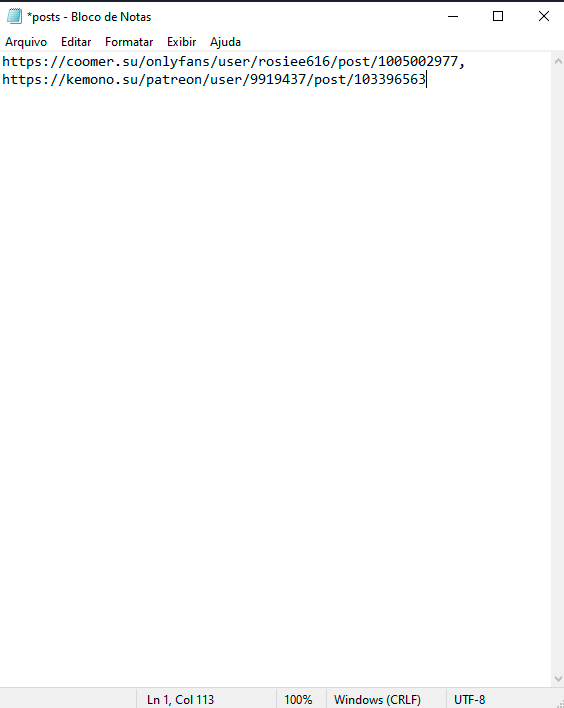
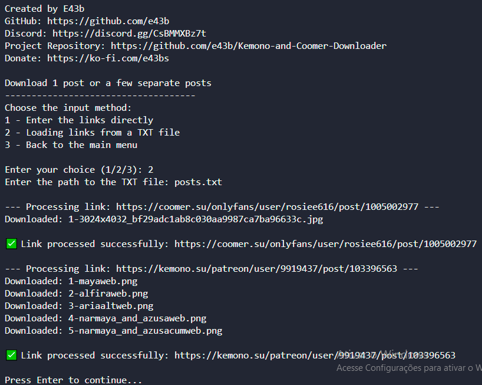
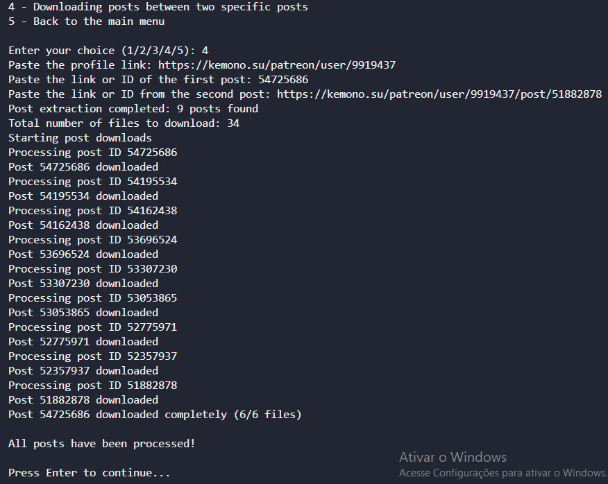

# Kemono and Coomer Downloader

[](https://github.com/e43b/Kemono-and-Coomer-Downloader/)

[ English](README.md) | [ Português](README-ptbr.md)

The **Kemono and Coomer Downloader** is a tool that allows you to download posts from [Kemono](https://kemono.su/) and [Coomer](https://coomer.su/) websites.

With this tool, you can download single posts, multiple posts sequentially, or download all posts from a Kemono or Coomer profile.

## Support Tool Development 💖

This tool was created with dedication to make your life easier and is maintained independently. If you find it useful and would like to contribute to its continuous improvement, consider making a donation.

Any help is welcome and will be used to cover maintenance costs, improvements, and the addition of new features. Your support makes all the difference!

[](https://ko-fi.com/e43bs)

### Why donate?
- **Continuous maintenance**: Help keep the tool always updated and working.
- **New features**: Contribute to implementing new functionalities requested by the community.
- **Show appreciation**: Show your support for the project and encourage the development of more tools like this.

🎉 Thank you for considering supporting this project!

## Star History

[](https://star-history.com/#e43b/Kemono-and-Coomer-Downloader&Date)

## How to Use

1. **Make sure you have Python installed on your system.**
2. **Clone this repository:**
```sh
git clone https://github.com/e43b/Kemono-and-Coomer-Downloader/
```

3. **Navigate to the project directory:**
```sh
cd Kemono-and-Coomer-Downloader
```

4. **Select your preferred language:**
   - The codeen folder contains the English version.
   - The codept folder contains the Portuguese version.

5. **Run the main script:**
```sh
python main.py
```

6. **Follow the menu instructions to choose what you want to download or customize the program.**

## Libraries

The required library is: requests. When starting the script for the first time, if the library is not installed, it will be installed automatically.

## Features

### Home Page

The project's home page presents the main options available to facilitate tool usage.


### Download Post

#### Option 1: Download 1 Post or Several Separate Posts

##### 1.1 Insert links directly

To download specific posts, enter the post links separated by commas. This option is ideal for downloading a few posts. Example:

```sh
https://coomer.su/onlyfans/user/rosiee616/post/1005002977, https://kemono.su/patreon/user/9919437/post/103396563
```



##### 1.2 Load links from a TXT file

If you have multiple post links to download, simplify the process using a `.txt` file.

###### Step 1: Creating the TXT File

1. Open a text editor of your choice (like Notepad, VS Code, or other).
2. List the post links in the following format:
   - Separate links with **commas**.
   - Example file content:
```sh
https://coomer.su/onlyfans/user/rosiee616/post/1005002977, https://kemono.su/patreon/user/9919437/post/103396563
```
3. Save the file with the `.txt` extension. For example: `posts.txt`.

###### Step 2: Locating the File Path

You can specify the file path to the script in two ways:

1. **Absolute Path**: Locate the file on your system and copy the complete path.
```sh
C:\Users\YourUser\Documents\posts.txt
```

2. **Relative Path**: If the file is in the same folder as the `main.py` script, just enter the file name.
```sh
posts.txt
```

###### Step 3: Running the Script

1. Paste the TXT file path in the console.
2. The script will automatically start downloading and process all links listed in the file.

###### TXT File Content



###### Script Running



##### 1.3 Return to main menu

Select this option to return to the home menu.

#### Option 2: Download All Posts from a Profile

⚠️ **General Attention**:
In this download mode, the `files.md` file with information such as title, description, embeds, etc., **will not be created**.
If you need this information, use **Option 1**.

##### 2.1: Download All Posts from a Profile

1. Enter a Coomer or Kemono profile link.
2. Press **Enter**.

**Notes**:
- This mode allows downloading all posts from the entered profile.
- **Limitation**: You cannot download more than one profile at a time.

The system will process the link, extract all posts, and perform the download.


##### 2.2: Download Posts from a Specific Page

1. Enter a Coomer or Kemono profile link.
2. Press **Enter**.
3. Enter the **offset** of the desired page.

**How to calculate the offset**:
- Both on Kemono and Coomer, offsets increase by 50:
  - Page 1: offset = 0
  - Page 2: offset = 50
  - Page 3: offset = 100
  - ...
- To find the offset of the desired page:
  1. Access the profile page.
  2. Click on the desired page and observe the number at the end of the link.
     Example:
```
https://kemono.su/patreon/user/9919437?o=750
```
In this case, the offset is **750**.

The system will process the specified page, extract the posts, and perform the download.


##### 2.3: Download Posts in a Page Range

1. Enter a Coomer or Kemono profile link.
2. Press **Enter**.
3. Enter the starting page **offset**.
4. Enter the ending page **offset**.

**How to calculate offsets**:
- The offset calculation follows the same logic as **Option 2.2**.
  - Example:
    - Page 1: offset = 0
    - Page 16: offset = 750

All posts between the specified offsets will be extracted and downloaded.


##### 2.4: Download Posts between Two Specific Posts

1. Enter a Coomer or Kemono profile link.
2. Press **Enter**.
3. Enter the link or ID of the **initial post**.
   - Example link:
```
https://kemono.su/patreon/user/9919437/post/54725686
```
   - Just the ID: `54725686`.
4. Enter the link or ID of the **final post**.

**What happens**:
The system will download all posts between the two specified IDs.



##### 2.5: Return to Main Menu

Select this option to return to the home page.

#### Option 3: Customize Program Settings

This option allows you to configure some program preferences. The available options are:

1. **Take empty posts**: `False`
2. **Download older posts first**: `False`
3. **For individual posts, create a file with information (title, description, etc.)**: `True`
4. **Choose the type of file to save the information (Markdown or TXT)**: `md`
5. **Back to the main menu**

##### Option Descriptions

###### Take Empty Posts
- Defines whether empty posts (without attached files) should be included in massive profile downloads.
  - **False (Recommended)**: Empty posts will be ignored.
  - **True**: A folder will be created for empty posts. Use this option only in specific cases.

###### Download Older Posts First
- Controls the order of post downloads in profiles:
  - **False**: Downloads the most recent posts first.
  - **True**: Downloads the oldest posts first.

###### Create Information File (Individual Posts)
- Defines whether a file containing information such as title, description, and embeds will be created when downloading individual posts:
  - **True**: Creates the information file.
  - **False**: Does not create the file.

###### File Type to Save Information
- Choose the format of the file created in **Individual Options**:
  - **Markdown (`md`)**: File in Markdown format.
  - **TXT (`txt`)**: File in simple text format.
  - **Note**: Both formats use Markdown structure.

###### How to Change Settings
To modify any of the options, simply type the corresponding number. The program will automatically toggle the value between available options (for example, from `True` to `False`).


#### Option 4: Exit Program

This option closes the program.

## File Organization

Posts are saved in folders to facilitate organization. The folder structure follows the pattern below:

### Folder Structure

1. **Platform**: A main folder is created for each platform (Kemono or Coomer).
2. **Author**: Within the platform folder, a folder is created for each author in the format **Name-Service-Id**.
3. **Posts**: Within the author's folder, there is a subfolder called `posts` where contents are organized.
   Each post is saved in a subfolder identified by the **post ID**.

### Example Folder Structure

```
Kemono-and-Coomer-Downloader/
│
├── kemono/                                 # Kemono platform folder
│   ├── Name-Service-Id/                    # Author folder in Name-Service-Id format
│   │   ├── posts/                          # Author's posts folder
│   │   │   ├── postID1/                    # Post folder with ID 1
│   │   │   │   ├── post_content            # Post content
│   │   │   │   ├── files.md                # (Optional) File with file information
│   │   │   │   └── ...                     # Other post files
│   │   │   ├── postID2/                    # Post folder with ID 2
│   │   │   │   ├── post_content            # Post content
│   │   │   │   └── files.txt               # (Optional) File with file information
│   │   │   └── ...                         # Other posts
│   │   └── ...                             # Other author content
│   └── Name-Service-Id/                    # Another author folder in Name-Service-Id format
│       ├── posts/                          # Author's posts folder
│       └── ...                             # Other content
│
└── coomer/                                 # Coomer platform folder
    ├── Name-Service-Id/                    # Author folder in Name-Service-Id format
    │   ├── posts/                          # Author's posts folder
    │   │   ├── postID1/                    # Post folder with ID 1
    │   │   │   ├── post_content            # Post content
    │   │   │   ├── files.txt               # (Optional) File with file information
    │   │   │   └── ...                     # Other post files
    │   │   └── postID2/                    # Post folder with ID 2
    │   │       ├── post_content            # Post content
    │   │       └── ...                     # Other post files
    │   └── ...                             # Other author content
    └── Name-Service-Id/                    # Another author folder in Name-Service-Id format
        ├── posts/                          # Author's posts folder
        └── ...                             # Other content
```


### About the `files.md` or `files.txt` File

The `files.md` (or `files.txt`, depending on the chosen configuration) file contains the following information about each post:
- **Title**: The post title.
- **Description/Content**: The post content or description.
- **Embeds**: Information about embedded elements (if any).
- **File Links**: URLs of files present in the **Attachments**, **Videos**, and **Images** sections.


## Contributions

This project is **open-source**, and your participation is very welcome! If you want to help improve the tool, feel free to:

- **Send suggestions** for new features or improvements.
- **Report issues** or bugs found.
- **Submit pull requests** with your own contributions.

You can contribute in various ways through our [GitHub repository](https://github.com/e43b/Kemono-and-Coomer--Downloader/) or interact with the community on our [Discord](https://discord.gg/GNJbxzD8bK).

## Author

The **Kemono and Coomer Downloader** was developed and is maintained by [E43b](https://github.com/e43b). Our goal is to make the process of downloading posts from **Kemono** and **Coomer** sites simpler, faster, and more organized, providing a smooth and accessible experience for users.

## Support

If you encounter problems, bugs, or have questions, our community is ready to help! Contact us through our [Discord](https://discord.gg/GNJbxzD8bK) for support or to ask questions.
